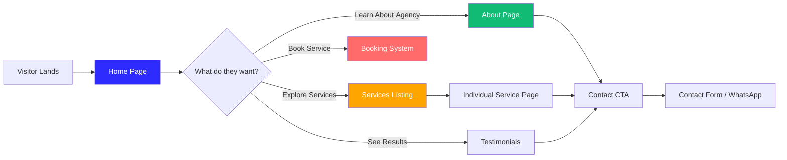
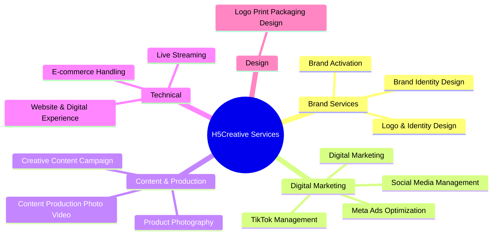
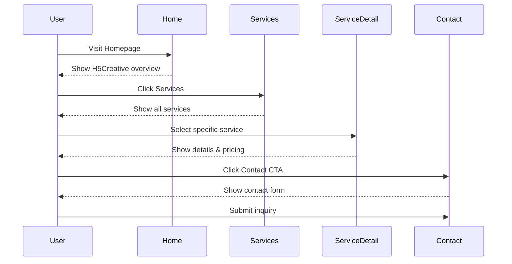

# H5Creative.com Site Structure Diagram

## Site Architecture

```mermaid
graph TD
    A[Home /] --> B[Services /service]
    A --> C[About /about]
    A --> D[Booking /booking]
    A --> E[Testimonials]
    A --> F[Pricing]

    B --> B1[Brand Activation]
    B --> B2[Social Media Management]
    B --> B3[TikTok Management]
    B --> B4[Live Streaming]
    B --> B5[Content Production]
    B --> B6[Digital Marketing]
    B --> B7[Logo Print Packaging Design]
    B --> B8[Product Photography]
    B --> B9[Meta Ads Optimization]
    B --> B10[E-commerce Handling]
    B --> B11[Logo Identity Design]
    B --> B12[Website Digital Experience]
    B --> B13[Creative Content Campaign]
    B --> B14[Brand Identity Visual Design]

    C --> C1[Company Overview]
    C --> C2[Milestones]
    C --> C3[Industries Served]
    C --> C4[Core Services]
    C --> C5[Key Capabilities]

    style A fill:#2E2BFF,color:#fff
    style B fill:#12BB74,color:#fff
    style C fill:#FF6B6B,color:#fff
```



## Page Flow



## Service Hierarchy



## User Journey



## Content Structure

### Home Page Sections

1. **Hero** - H5Creative introduction
2. **Services Overview** - Quick service preview
3. **Logo Section** - Client logos
4. **Recent Work** - Portfolio showcase
5. **Business Section** - How we help
6. **CTA** - Call to action
7. **FAQ** - Common questions
8. **Contact** - Contact form

### About Page Sections

1. **Hero** - Company introduction
2. **Company Overview** - Who we are
3. **Key Capabilities** - What we do
4. **Milestones** - Our achievements
5. **Industries Served** - Our clients
6. **Core Services** - Service overview
7. **CTA** - Contact us

### Service Page Sections

1. **Hero** - Service introduction
2. **Features** - What's included
3. **Benefits** - Why choose us
4. **Process** - How we work
5. **Pricing** (if applicable) - Package details
6. **CTA** - Get started

## Navigation Structure

```
┌─────────────────────────────────────────────────────────┐
│  LOGO    Home  Services  Booking  Testimonials  About  │
│                                                         │
└─────────────────────────────────────────────────────────┘
         │        │          │           │         │
         │        │          │           │         └─→ About Page
         │        │          │           └──────────→ Testimonials
         │        │          └──────────────────────→ Booking
         │        └───────────────────────────────────→ Services
         └────────────────────────────────────────────→ Home
```

## Mobile Navigation

```
┌─────────────────────────┐
│  ☰              LOGO   │
├─────────────────────────┤
│                         │
│  Home                   │
│  Services               │
│  Booking                │
│  Testimonials           │
│  About                  │
│                         │
│  [Konsultasi Sekarang]  │
│                         │
└─────────────────────────┘
```

## Implementation Priority

### Phase 1: Core Pages (High Priority)

1. ✅ Analyze structure
2. Update services data
3. Create /service page
4. Create /about page
5. Update home page

### Phase 2: Service Pages (Medium Priority)

6. Create individual service pages
7. Update navigation
8. Add pricing information

### Phase 3: Polish (Low Priority)

9. Testing and verification
10. SEO optimization
11. Performance optimization
