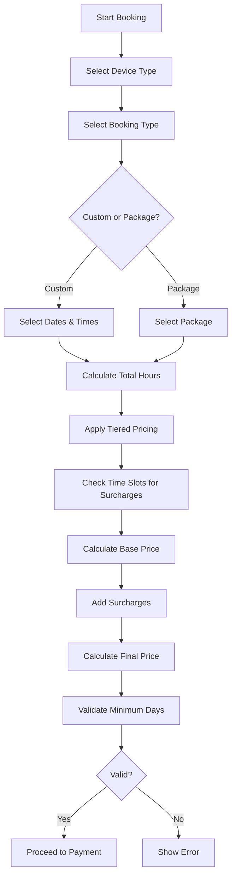

# Live Streaming Pricing System Implementation Plan

## Overview

Implement a comprehensive live streaming booking system with tiered pricing based on total hours purchased and time-based surcharges for non-operational hours.

## Business Requirements

### Device Types & Base Pricing

#### iPhone Device

- **Operational Hours**: 09:00 - 20:00
- **Base Price**: 70,000 IDR/hour
- **Tiered Pricing**:
  - 0-70 hours: 70,000 IDR/hour
  - 71-140 hours: 65,000 IDR/hour
  - 141-250 hours: 60,000 IDR/hour
  - 250+ hours: 55,000 IDR/hour

#### Camera + OBS Device

- **Operational Hours**: 09:00 - 20:00
- **Base Price**: 125,000 IDR/hour
- **Tiered Pricing**:
  - 0-70 hours: 125,000 IDR/hour
  - 71-140 hours: 115,000 IDR/hour
  - 141-200 hours: 105,000 IDR/hour
  - 200+ hours: 95,000 IDR/hour

### Time-Based Surcharges

- **07:00 - 21:00**: Normal pricing (no surcharge)
- **21:00 - 01:00**: +15,000 IDR/hour surcharge
- **01:00 - 07:00**: +20,000 IDR/hour surcharge

### Booking Options

1. **Live Custom Jam**: Custom time selection (minimum 6 days)
2. **Live Paket Jam**: Pre-defined package slots (minimum 5 days)

### Available Time Slots

- 09:00 - 11:00
- 11:00 - 13:00
- 13:00 - 15:00
- 14:00 - 16:00
- 16:00 - 18:00
- 18:00 - 20:00
- 19:00 - 21:00

## System Architecture

### Database Schema Updates

#### New Tables/Fields

**PricingTier Table**

```prisma
model PricingTier {
  id            String   @id @default(uuid())
  deviceType    String
  minHours      Int
  maxHours      Int?
  pricePerHour  Int
  isActive      Boolean  @default(true)
  createdAt     DateTime @default(now())
  updatedAt     DateTime @updatedAt
}
```

**TimeSurcharge Table**

```prisma
model TimeSurcharge {
  id            String   @id @default(uuid())
  startTime     String
  endTime       String
  surcharge     Int
  description   String
  isActive      Boolean  @default(true)
  createdAt     DateTime @default(now())
  updatedAt     DateTime @updatedAt
}
```

**Package Table Updates**

```prisma
model Package {
  // ... existing fields
  packageType   String   // "iPhone" or "Camera+OBS"
  bookingType   String   // "custom" or "package"
  totalHours    Int
  numberOfDays  Int
  tieredPrice   Boolean  @default(true)
  // ... other fields
}
```

**Booking Table Updates**

```prisma
model Booking {
  // ... existing fields
  totalHours    Int
  basePrice     Int
  surcharge     Int      @default(0)
  finalPrice    Int
  pricingTierId String?
  // ... other fields
}
```

### Pricing Calculation Logic



### Component Updates

#### 1. DeviceSelection Component

- Add pricing preview for each device type
- Display tiered pricing information
- Show operational hours

#### 2. PackageSelection Component

- Split into two tabs: "Custom Jam" and "Paket Jam"
- For Custom Jam:
  - Allow users to select number of hours
  - Show tiered pricing based on selected hours
  - Enforce minimum 6 days requirement
- For Paket Jam:
  - Display pre-defined packages
  - Show package details (hours, days, price)
  - Enforce minimum 5 days requirement

#### 3. TimeSlotSelection Component

- Display available time slots with surcharge indicators
- Highlight time slots with surcharges
- Show surcharge amount for each slot
- Allow custom time requests with validation
- Display operational vs non-operational hours

#### 4. BookingSummary Component

- Display detailed pricing breakdown:
  - Base price calculation
  - Tiered pricing applied
  - Time-based surcharges
  - Total hours selected
  - Final price
- Show pricing tier information
- Display any applicable surcharges

### API Updates

#### 1. Pricing Calculation API

```typescript
// GET /api/pricing/calculate
interface PricingCalculationRequest {
  deviceType: "iPhone" | "Camera+OBS"
  totalHours: number
  timeSlots: Array<{
    startTime: string
    endTime: string
    date: string
  }>
}

interface PricingCalculationResponse {
  basePrice: number
  tieredPrice: number
  surcharges: Array<{
    timeSlot: string
    amount: number
    reason: string
  }>
  totalSurcharge: number
  finalPrice: number
  pricingTier: {
    minHours: number
    maxHours: number | null
    pricePerHour: number
  }
}
```

#### 2. Booking API Updates

- Add dynamic pricing calculation
- Store pricing breakdown in booking
- Validate minimum purchase requirements
- Apply tiered pricing based on total hours

#### 3. Package API Updates

- Filter packages by booking type (custom/package)
- Include tiered pricing information
- Return pricing tiers for device type

### Utility Functions

```typescript
// lib/pricing.ts

interface PricingTier {
  deviceType: string
  minHours: number
  maxHours: number | null
  pricePerHour: number
}

interface TimeSurcharge {
  startTime: string
  endTime: string
  surcharge: number
  description: string
}

export function getPricingTier(
  deviceType: string,
  totalHours: number,
): PricingTier | null {
  // Get applicable pricing tier based on total hours
}

export function getTimeSurcharge(startTime: string, endTime: string): number {
  // Calculate surcharge for time slot
}

export function calculateTotalPrice(
  deviceType: string,
  totalHours: number,
  timeSlots: Array<{ startTime: string; endTime: string }>,
): {
  basePrice: number
  tieredPrice: number
  surcharges: number
  finalPrice: number
} {
  // Calculate complete pricing breakdown
}

export function validateMinimumDays(
  bookingType: "custom" | "package",
  numberOfDays: number,
): boolean {
  // Validate minimum purchase requirements
}

export function isOperationalHour(time: string, deviceType: string): boolean {
  // Check if time is within operational hours
}
```

### UI/UX Improvements

#### Pricing Display

- Show tiered pricing table for each device type
- Highlight current pricing tier
- Display savings from higher tiers
- Show surcharge information prominently

#### Time Selection

- Color-code time slots:
  - Green: Operational hours (no surcharge)
  - Yellow: 21:00-01:00 (+15k surcharge)
  - Red: 01:00-07:00 (+20k surcharge)
- Show surcharge amount on hover
- Display total surcharge in summary

#### Validation Messages

- Clear error messages for minimum purchase requirements
- Show pricing breakdown before confirmation
- Display savings opportunities for higher tiers

### Implementation Steps

1. **Database Schema Updates**
   - Create PricingTier table
   - Create TimeSurcharge table
   - Update Package table
   - Update Booking table
   - Seed initial pricing tiers and surcharges

2. **Backend Implementation**
   - Create pricing calculation utilities
   - Update booking API with dynamic pricing
   - Update package API with tiered pricing
   - Add validation for minimum purchase requirements

3. **Frontend Components**
   - Update DeviceSelection with pricing preview
   - Redesign PackageSelection with custom/package tabs
   - Enhance TimeSlotSelection with surcharge indicators
   - Update BookingSummary with detailed breakdown

4. **Admin Panel Updates**
   - Add pricing tier management
   - Add time surcharge management
   - Update package management with tiered pricing
   - Add booking analytics with pricing breakdown

5. **Testing**
   - Test tiered pricing calculations
   - Test time-based surcharges
   - Test minimum purchase validation
   - Test edge cases (boundary hours, mixed time slots)
   - Test booking flow end-to-end

### Data Seeding

```sql
-- Pricing Tiers for iPhone
INSERT INTO PricingTier (deviceType, minHours, maxHours, pricePerHour) VALUES
('iPhone', 0, 70, 70000),
('iPhone', 71, 140, 65000),
('iPhone', 141, 250, 60000),
('iPhone', 251, NULL, 55000);

-- Pricing Tiers for Camera+OBS
INSERT INTO PricingTier (deviceType, minHours, maxHours, pricePerHour) VALUES
('Camera+OBS', 0, 70, 125000),
('Camera+OBS', 71, 140, 115000),
('Camera+OBS', 141, 200, 105000),
('Camera+OBS', 201, NULL, 95000);

-- Time Surcharges
INSERT INTO TimeSurcharge (startTime, endTime, surcharge, description) VALUES
('07:00', '21:00', 0, 'Normal operational hours'),
('21:00', '01:00', 15000, 'Evening surcharge'),
('01:00', '07:00', 20000, 'Early morning surcharge');
```

### Edge Cases & Considerations

1. **Mixed Time Slots**: Handle bookings with slots across different surcharge periods
2. **Boundary Hours**: Clear rules for time slots that span surcharge boundaries
3. **Tier Upgrades**: Show users how many more hours needed for next tier
4. **Custom Time Requests**: Validation for custom time requests outside available slots
5. **Package Modifications**: Handle changes to existing bookings with different pricing
6. **Price Updates**: Handle historical bookings when pricing tiers change

### Success Metrics

- Accurate pricing calculations across all scenarios
- Clear display of pricing breakdown to users
- Proper validation of minimum purchase requirements
- Smooth user experience for both custom and package bookings
- Admin panel functionality for managing pricing rules

## Next Steps

1. Review and approve this plan
2. Switch to Code mode to implement the changes
3. Test thoroughly before deployment
4. Gather user feedback and iterate
